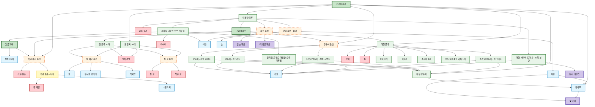

```mermaid
graph TD
    %% 스타일 정의
    classDef loot fill:#ffcdd2,stroke:#b71c1c,stroke-width:2px,color:black;
    classDef raw fill:#e1f5fe,stroke:#0277bd,stroke-width:2px,color:black;
    classDef tool fill:#fff9c4,stroke:#fbc02d,stroke-width:2px,color:black;
    classDef station fill:#d1c4e9,stroke:#4527a0,stroke-width:2px,color:black;
    classDef item fill:#e8f5e9,stroke:#2e7d32,stroke-width:2px,color:black;
    classDef final fill:#c8e6c9,stroke:#1b5e20,stroke-width:4px,color:black;
    classDef optional fill:#fff3e0,stroke:#e65100,stroke-width:2px,stroke-dasharray: 5 5,color:black;

    %% 최종 목표: 고급 제작소들
    AdvKiln[고급 가마]:::final
    AdvFurnace[고급 용광로]:::final
    AdvForge[고급 대장간]:::final

    %% 고급 가마의 직접 재료
    Clay20[점토 20개]:::raw
    TrowelOption[석공 흙손 옵션]:::optional
    MasonTrowel[석공 흙손]:::loot
    MasonTrowelWood[석공 흙손 - 나무]:::tool
    Knife[칼 계열]:::loot
    Twig[나뭇가지]:::raw

    %% 고급 용광로의 직접 재료
    StoneBlock40[돌 블록 40개]:::item
    BucketOption[양동이 옵션]:::optional
    LargeBellows[대형 풀무]:::item
    StoneOption[돌 재료 옵션]:::optional
    HammerType[망치 계열]:::loot
    ChiselOption[돌 끌 옵션]:::optional
    Stone[돌]:::raw
    Flint[부싯돌 덩어리]:::raw
    Limestone[석회암]:::raw
    StoneChisel[돌 끌]:::loot
    MasonChisel[석공 끌]:::loot
    CementBucket[양동이 - 점토 시멘트]:::item
    ConcreteBucket[양동이 - 콘크리트]:::item
    CarvedCementBucket[조각된 양동이 - 점토 시멘트]:::item
    CarvedConcreteBucket[조각된 양동이 - 콘크리트]:::item
    Clay[점토]:::raw
    WoodBucket[나무 양동이]:::item
    Wood[통나무]:::raw
    Hammer[망치]:::loot
    Saw[톱]:::loot
    Planks2[판자 2개]:::item
    Nails2[못 2개]:::item
    Handles2[손잡이 2개]:::item
    TannedLeather[무두질한 중형 가죽 1개]:::item

    %% 고급 대장간의 직접 재료
    StoneBlock30[돌 블록 30개]:::item
    ForgeAnvil[대장간 모루]:::item
    CeramicAnvilMold[세라믹 대장간 모루 거푸집]:::item
    MetalTongs[금속 집게]:::loot
    FuelOption[연료 옵션 - 10개]:::optional
    LargeCeramicCrucible[대형 세라믹 도가니 - 32회 분량]:::item
    FireOption[화로 옵션]:::optional
    UnfiredAnvilMold[굽지 않은 점토 대장간 모루 거푸집]:::item
    Lighter[라이터]:::loot
    Coal[석탄]:::raw
    Charcoal[목탄]:::raw
    Coke[숯]:::raw
    CharcoalPit[숯 가마]:::station
    PrimForge[원시 대장간]:::station
    SimpleFire[단순 화로]:::station
    BetterFire[더 좋은 화로]:::station

    %% 연결 관계 - 고급 가마
    AdvKiln --> Clay20
    AdvKiln --> TrowelOption
    TrowelOption --> MasonTrowel
    TrowelOption --> MasonTrowelWood
    MasonTrowelWood --> Knife
    MasonTrowelWood --> Twig

    %% 연결 관계 - 고급 용광로
    AdvFurnace --> StoneBlock40
    AdvFurnace --> BucketOption
    AdvFurnace --> LargeBellows
    AdvFurnace --> TrowelOption
    StoneBlock40 --> StoneOption
    StoneBlock40 --> HammerType
    StoneBlock40 --> ChiselOption
    StoneOption --> Stone
    StoneOption --> Flint
    StoneOption --> Limestone
    ChiselOption --> StoneChisel
    ChiselOption --> MasonChisel
    BucketOption --> CementBucket
    BucketOption --> ConcreteBucket
    BucketOption --> CarvedCementBucket
    BucketOption --> CarvedConcreteBucket
    CementBucket --> Clay
    CementBucket --> WoodBucket
    ConcreteBucket --> Clay
    ConcreteBucket --> WoodBucket
    CarvedCementBucket --> Clay
    CarvedCementBucket --> WoodBucket
    CarvedConcreteBucket --> Clay
    CarvedConcreteBucket --> WoodBucket
    WoodBucket --> Wood
    LargeBellows --> Hammer
    LargeBellows --> Saw
    LargeBellows --> Planks2
    LargeBellows --> Nails2
    LargeBellows --> Handles2
    LargeBellows --> TannedLeather

    %% 연결 관계 - 고급 대장간
    AdvForge --> StoneBlock30
    AdvForge --> BucketOption
    AdvForge --> ForgeAnvil
    AdvForge --> WoodBucket
    AdvForge --> Wood
    AdvForge --> LargeBellows
    AdvForge --> TrowelOption
    StoneBlock30 --> StoneOption
    StoneBlock30 --> HammerType
    StoneBlock30 --> ChiselOption
    ForgeAnvil --> CeramicAnvilMold
    ForgeAnvil --> MetalTongs
    ForgeAnvil --> FuelOption
    ForgeAnvil --> LargeCeramicCrucible
    ForgeAnvil --> FireOption
    ForgeAnvil --> AdvFurnace
    CeramicAnvilMold --> UnfiredAnvilMold
    CeramicAnvilMold --> Lighter
    CeramicAnvilMold --> Coal
    CeramicAnvilMold --> AdvKiln
    UnfiredAnvilMold --> Clay
    FuelOption --> Charcoal
    FuelOption --> Coal
    FuelOption --> Coke
    Charcoal --> Wood
    Charcoal --> CharcoalPit
    Wood --> CharcoalPit
    LargeCeramicCrucible --> Clay
    LargeCeramicCrucible --> PrimForge
    FireOption --> SimpleFire
    FireOption --> BetterFire
```
